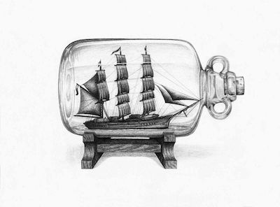
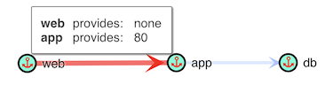

# Bottle

<p align="center">
  
</p>

>self-contained, simple, and scalable application-like traffic simulator

Bottle uses Kubernetes to deploy distributed stateful traffic generators ("ships") that behave like real application components.

Bottle allows the user to spin up complex and high scaling scenarios with very little configuration or resources.

Bottle intergrates with Tetration sensors to monitor and map application traffic and optionally enforce segmentation policy.

## Getting Started

To use bottle, you will need:

* A kubernetes cluster
* A machine with `docker` installed and configured
* A machine with `kubectl` installed and configured
* A machine with `helm` installed and configured

### Quick Start

```bash
# clone the repository
> git clone https://cto-github.cisco.comcom/tigarner/bottle
> cd bottle

# copy your clusters agent rpm
> cp ~/Downloads/myclustersensor.rpm sensor/sensor.rpm

# copy your clusters api credentials (must have sw agent privilege)
> cp ~/Downloads/api_credentials.json sensor/

# build the image and tag
> docker build -f sensor/Dockerfile -t bottle:yourcluster .

# run a scenario with the image
> helm install -f scenarios/3tier.yaml --set image=bottle:yourcluster ./bottle

# example helm output
# a unique name will be created for each deployed scenario
# in this example output it is "interested-frog"
# use this name to refer to the scenario while it is running

    NAME:   interested-frog
    LAST DEPLOYED: Tue Jul  3 11:36:49 2018
    NAMESPACE: default
    STATUS: DEPLOYED

    RESOURCES:
    ==> v1/ConfigMap
    NAME          DATA  AGE
    3tier-config  3     0s

    ==> v1/Service
    NAME  TYPE       CLUSTER-IP  EXTERNAL-IP  PORT(S)   AGE
    db    ClusterIP  None        <none>       3306/TCP  0s
    web   ClusterIP  None        <none>       <none>    0s
    app   ClusterIP  None        <none>       80/TCP    0s

    ==> v1beta1/Deployment
    NAME  DESIRED  CURRENT  UP-TO-DATE  AVAILABLE  AGE
    app   1        1        1           0          0s
    db    1        1        1           0          0s
    web   1        1        1           0          0s

    ==> v1/Pod(related)
    NAME                  READY  STATUS             RESTARTS  AGE
    app-58d5747d69-rd6nn  0/3    ContainerCreating  0         0s
    db-5499fcffff-27t6k   0/3    ContainerCreating  0         0s
    web-7558fc4c8f-swvv4  0/3    ContainerCreating  0         0s


    NOTES:
    Installed bottle scenario 3tier

    Your release is named interested-frog.

    To learn more about the release, try:

    $ helm status interested-frog
    $ helm get interested-frog

# check the status of the scenario
> helm status interested-frog 

# delete the created objects
> helm delete interested-frog
```

## Overview

Bottle uses scenario templates to describe a set of application tiers and the communication patterns between.

A standard three tier application might have a traffic flow diagram as such:

```c
[web]--[80]-->[app]--[3306]-->[db]
```

An example bottle scenario to simulate that three tier web app, with traffic flowing between each tier:

```yaml
name: 3tier
ships:
    web: 
        replicas: 3
        clients:
        - app:80
    app: 
        replicas: 2
        servers:
        - 80
        clients:
        - db:3306
    db:
        replicas: 1
        servers:
        - 3306
```

Bottle will parse this file and create the necessary kubernetes components (services & deployments & pods) to simulate the environment.

Load generators will run on each tier sending and receiving traffic as laid out in the scenario.

Running the Tetration application dependency mapping algorithms on the deployed endpoints will result in a policy graph that mirrors the original scenario file, discovered via observed flow data.



## Scenarios

Scenarios describe the application components ("ships") and the traffic between them, plus some optional metadata. 

Each `ship` starts with a key to describe the component name, and:

* `replicas` describes the count of endpoints in this component
* `clients` describes the outgoing connections from this component
* `servers` describes the listening sockets on this component

Each `client` must be a hostname and port number, like `db:3306`.

Each `server` must be a port number.

Each `client` will attempt to connect to the named server (`ship` names will be resolvable from within the cluster)

Once successfully connected, the client will send a small request, and the server will respond, finally, the connection will close.

The client will initiate a new connection after a 30 second wait.

## Generator Image

*You must create a unique image tailored to the Tetration cluster you will monitor the scenario on.*

*Failure to do so will cause the scenario to fail to deploy.*

The traffic generator pods will be deployed using the image you provide, this image must include a sensor and set of API credentials for the cluster you wish to analyse the traffic on.

### Sensor

The sensor you provide should meet the following critiria:

* Deep Visibility or Enforcement
* CentOS 7.4

### Credentials

The API credentials you provide should meet the following critiria:

* For the same cluster as the provided sensor
* Have the "SW sensor management: API to configure and monitor status of SW sensors" capability
* Have the "User data upload" capability

### Building

Once you have collected the sensor RPM and API credentials, you can build the image

```bash
# This example assumes you are in the root of the project directory
# The cluster name used in this example is "pliny"

# If the sensor has been downloaded with the name "tet-sensor-2.3.1.45-1.el7-pliny.enforcer.x86_64.rpm"
> cp ~/Downloads/tet-sensor-2.3.1.45-1.el7-pliny.enforcer.x86_64.rpm sensor/sensor.rpm

# If the api credentials have been downloaded with the name "api_credentials.json"
> cp ~/Downloads/api_credentials.json sensor/

# The dockerfile must then be built, it will bake the RPM and API credentials into the image
# This example will create a local image tagged as "bottle:pliny"
> docker build -f sensor/Dockerfile -t bottle:pliny .
```

### Tagging the Image

When building (or after) please tag the image and, if desired, push your image to a repository the target Kubernetes cluster has access to.

```bash
# Tag the image and push to the docker registry
> docker tag bottle:pliny <user>/bottle:pliny
> docker push <user>/bottle:pliny
```

## Using Bottle

Invoke the `helm install` command to deploy a scenario using a tagged image file. 

```
helm install -f scenarios/<scenario name>.yaml --set image=bottle:<clustername> ./bottle
```

* The helm executable will parse the the chosen scenario and extract the tier names
* a config map will be created with the traffic generator settings
* deployments will be created for each tier
* services will be created for each tier server port
* each deployment will have a file loaded at `/etc/ship/conf.yaml` with the client/server config
* each deployment container will read the config file and set up the traffic streams
* each deployment container will install and run a tetration sensor
* each deployment container will create an annotation in Tetration (at the optional scopename)
* all resources can be managed as usual kubernetes resources at this point

## Tips

### Remote VRF

If you wish to assign the agents created by scenarios to a custom scope, utilize remote vrf configuration on the cluster to assign the public addresses of the nodes in the kubernetes.

### Inspecting

When you have deployed a scenario, you may be interested to check the status.

Each "ship" is comprised of three containers in a pod, sharing a network namespace:

* The sensor container runs the Tetration sensor
* The enforcer container runs the Tetration enforcer
* The generator container runs the "ship" traffic generator executable

To view logs for the sensor for a given `<scenario> <component> [sensor|enforcer|generator]`:

```bash
> kubectl logs -l scenario=<scenario> <component> [sensor|enforcer|generator]
```

To attach into the shell of a component (&container):

```bash
> kubectl exec -it <component> -c [sensor|enforcer|generator] -- /bin/bash
```

### Enforcement

If desired, each `ship` can can run the `tet-enforcer` process, and therefore control the `iptable` rules within the pod namespace.

This allows you to test Tetraion's policy enforcement capability in a sandboxed environment.

If you wish to view the iptable rules, you can either attach into the shell of the `generator` container as described above, or run the following command:

```bash
> kubectl exec <component> -c enforcer -- iptables -L -n
```

## Project Goals

This project is in a alpha stage and should be seen as a minimum viable implementation.

The first goal of being able to generate application like traffic that is useful for Tetration application dependency maps has been achieved.

The current goal of the project is to enrich the scenario specification DSL to include more parameters like configurable traffic pattern, injecting network latency, application latency, and as a stretch to simulate application layer exploits.

### Tasks

- [x] Build Tetration agent into generator image
- [x] Scenario DSL to describe application topology
- [x] Deployment to Kubernetes cluster
- [x] Register Tetration agent at run time
- [x] Generate stateful (TCP) application-like traffic
- [x] De-register Tetration agent at destroy time
- [x] Support enforcement in container
- [ ] Annotate endpoints with scenario and lifecycle
- [ ] Advanced scenario parameters
    - [ ] Client type (short request, long request, etc.)
    - [ ] Server type (small reply, large reply, etc.)
    - [ ] Network delay
    - [ ] Application delay
- [ ] Report statistics to logging database
- [ ] Visualize stastics from logging database


